# 📼 NAS Model Cassette Changer

**Keep every AI model you own on a NAS. Play any of them on your GPU box with one click, without ever knocking out the model you are using.**

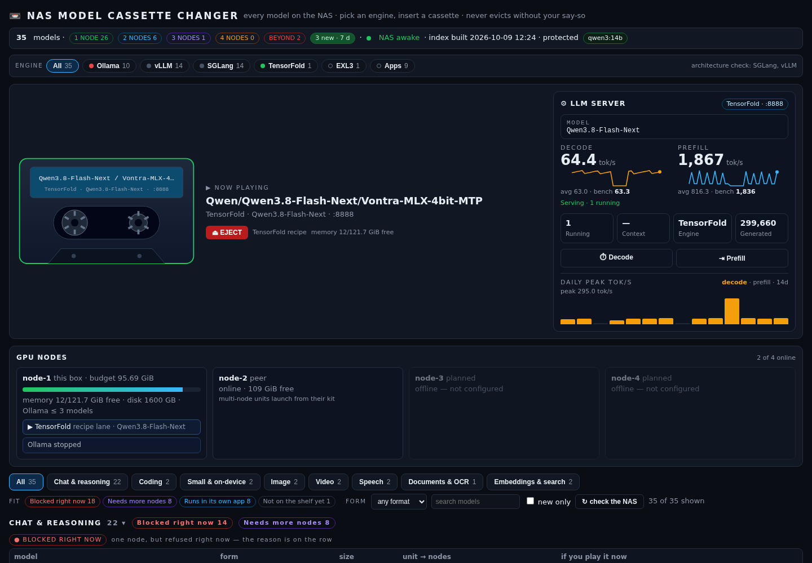

Local models are huge. A GPU box has a fast but small disk; a NAS has lots of cheap space but is far too slow to serve from. The NAS Model Cassette Changer treats every model like a cassette on a shelf:

- **The shelf (NAS)**: a small indexer catalogues every model folder: maker, model, variant, format, quantisation and size. It also works out how many GPU nodes each one needs.
- **The deck (GPU box)**: a web page lists the whole shelf. Press **INSERT** and it copies the model to local NVMe and starts it: in **Ollama** (GGUF), in a **vLLM** or **SGLang** container (safetensors, your choice per model), or with the model's own **recipe lane** (for example a **TensorFold** serving recipe).
- **The guard**: an insert never stops anything you didn't name. If loading a model would evict something, the deck lists exactly what would stop and waits until you tick every name. Models you mark as *protected* keep their memory reserved even when they are unloaded.
- **The ejector**: stops the cassette and, if you ask, deletes the local copy. The NAS copy is never touched.

## The cassette selector (v1.3)

- **ENGINE bar:** All · Ollama · vLLM · SGLang · every recipe lane (e.g. TensorFold) · EXL3 · Apps, each with its model count and a status dot
  (green = playing now, red = Ollama stopped, grey = idle, hollow = listed but not playable from the deck). Pick one and the whole shelf shows only
  what that engine plays. Links work too: `http://deck:8099/#engine=vLLM`.
- **The player:** a cassette that shows what is loaded, what else is resident, and memory free. The reels turn **only while a cassette is
  loading**; a loaded cassette sits still with its border green. A failed load stays on the player (*⚠ last load failed: … — why*) until you
  dismiss it or a load succeeds.
- **Architecture check:** before anything is copied or stopped, a safetensors model's `config.json` architectures are checked against the list
  its engine image can actually load (`mcc_deck.py archs vllm`). A model the image can't run is refused up front instead of after a long copy.
- **NAS dot** in the header: green = awake at the last sync, red = asleep (the last index is shown).

### Benchmarks beside the tape

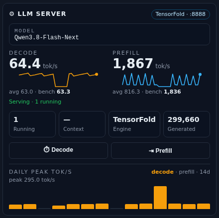

To the right of the cassette, the **LLM server** card measures whatever is loaded:

- **Decode / Prefill tok/s, live**, read every 5 s from the engine's own Prometheus counters (`/metrics` on vLLM, SGLang, or a recipe lane
  with `metrics_path`), with a 30-minute sparkline, the average while busy, and *Serving · n running* or *Idle · last served 2m ago*.
- **Running requests, context, engine, tokens generated** since the engine started.
- **⏱ Decode** (256 tokens out, timed after the first token) and **⇥ Prefill** (≈ 2,000 tokens in, time to first token) benchmark buttons.
  They work on Ollama too, using Ollama's own timings. Every prompt starts with a random nonce, so prefix caches can't flatter the number.
- **Daily peak tok/s** for the last 14 days, decode or prefill.

Results are kept in `bench.jsonl` / `peaks.json` in the state dir. Quality and tool-use evals are not part of this build.
<br clear="right">

It is two plain Python files with **no dependencies** beyond the standard library, plus `ssh`, `rsync`, Ollama and/or Docker on the GPU box.

## Engines

| Model on the NAS | Played by | How |
|---|---|---|
| GGUF (any quant, split shards, vision projector) | **Ollama** | `ollama create deck/<name>` + warm load at a fixed context |
| safetensors | **vLLM** | `vllm/vllm-openai` container on :8010 |
| safetensors | **SGLang** | `lmsysorg/sglang` container on :30000 |
| anything listed in `recipes.json` | **its recipe lane**, e.g. **TensorFold** | the recipe's own `start.sh` / `stop.sh`, health-checked |
| EXL3 / EXL2 | *listed under EXL3, not played yet* | needs an exllamav3 / TabbyAPI player; the selector shows them so you know they are there |

One GPU engine at a time: a vLLM, SGLang or recipe cassette must be ejected before another one is inserted. Recipe lanes such as TensorFold state their own memory need, and the deck checks it before stopping anything. If the recipe needs Ollama stopped, the deck says so and waits for you; it never stops a system service itself. See the [User Guide §7](docs/USER_GUIDE.md#7-engines-and-recipe-lanes-sglang-tensorfold).

## Use 10 GbE between the NAS and the GPU box

Every INSERT is a full copy of the model, so the link sets how long you wait:

| Link | Real-world copy rate | 20 GB GGUF | 65 GB safetensors | 113 GB model |
|---|---|---|---|---|
| 1 GbE | ~110 MB/s | ~3 min | ~10 min | ~17 min |
| 2.5 GbE | ~280 MB/s | ~1.2 min | ~4 min | ~7 min |
| **10 GbE** | **~800–1100 MB/s** | **~20–25 s** | **~1–1.5 min** | **~2 min** |

**A 10 GbE link (NICs on both boxes and a 10 GbE switch or a direct cable) is strongly recommended.** It only pays off if the NAS disks can keep up: one hard drive tops out around 150–250 MB/s. Use several drives, an SSD/NVMe pool or a read cache on the NAS. Ejecting is instant either way (it stops the model and, if you ask, deletes the local copy), and with a fast link re-inserting a model you deleted takes about a minute.

---

## Download

```bash
git clone https://github.com/sunnychase/nas-model-cassette-changer.git
cd nas-model-cassette-changer
```

Or download the ZIP: **Code → Download ZIP** on the GitHub page, or grab a tagged release from the **Releases** tab.

## Try it in 10 seconds (no NAS, no GPU)

```bash
python3 deck/mcc_deck.py serve --demo
# open http://127.0.0.1:8099/
```

Demo mode fakes a 35-model NAS and a 128 GB GPU box. Insert, eject, the guard dialog and the log all work; nothing on your machine is touched. Add `--demo-no-ollama` to simulate a box with Ollama stopped, so you can play the TensorFold recipe row.

## Screenshots

| The shelf, grouped by how many nodes each model needs | The guard: nothing stops until you name it |
|---|---|
| 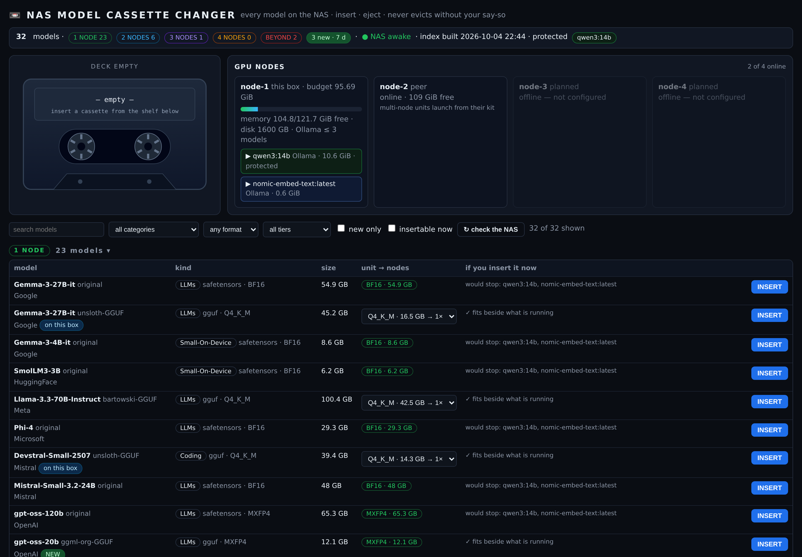 | 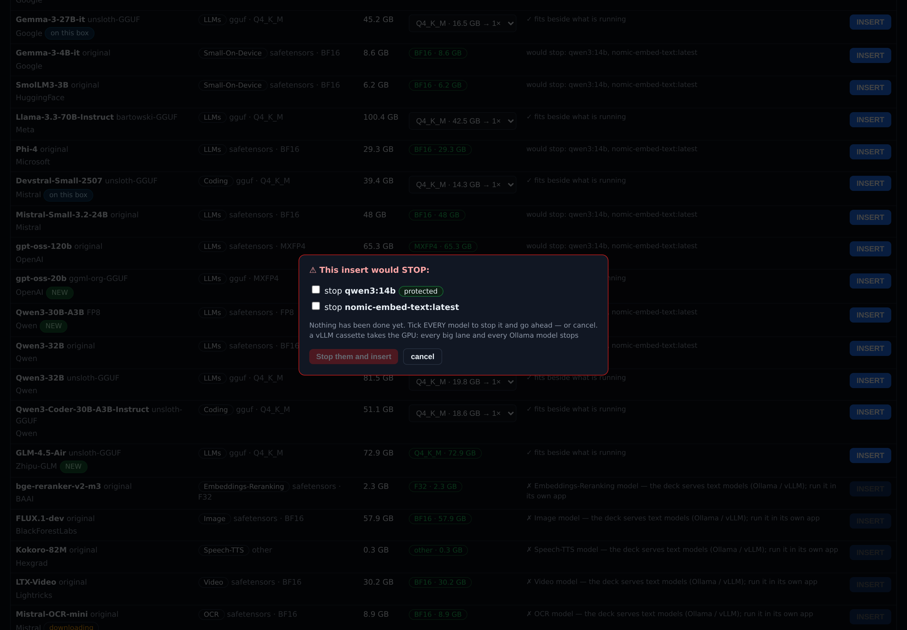 |
| **Loading:** a resumable rsync from the NAS, then start | **Ejector and deck log** |
| 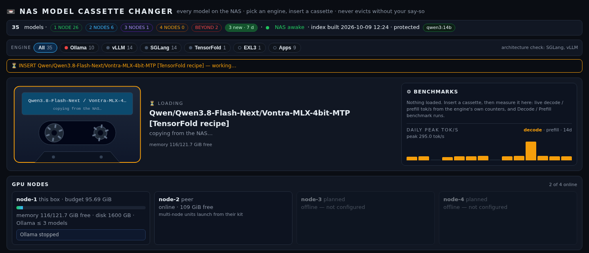 | 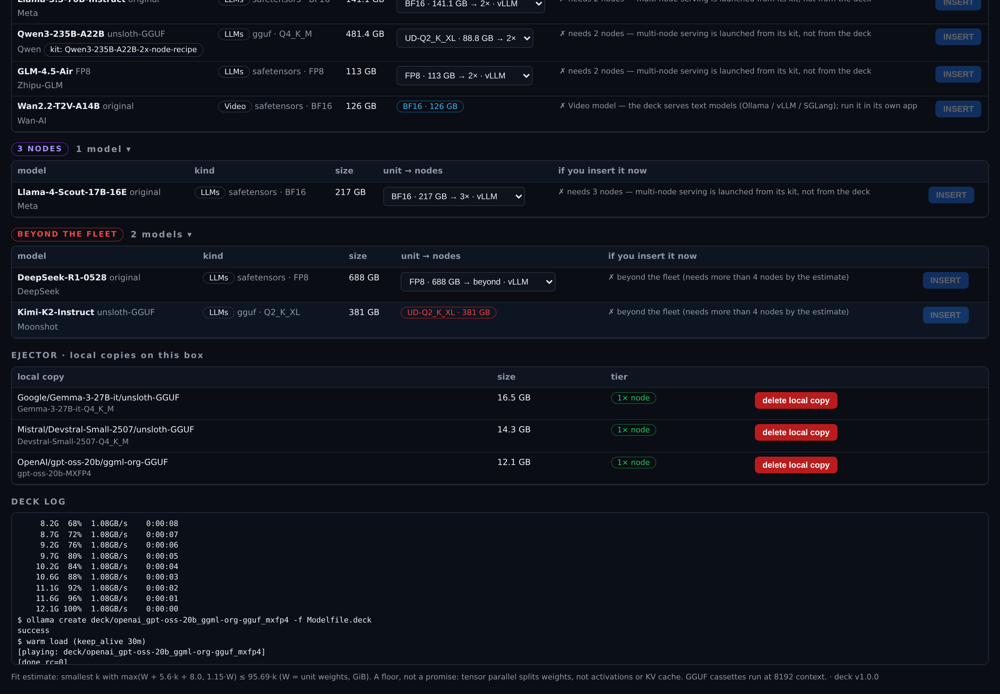 |
| **Engines:** vLLM or SGLang per model, plus a TensorFold recipe row | **A TensorFold recipe lane playing** (Ollama stopped) |
| 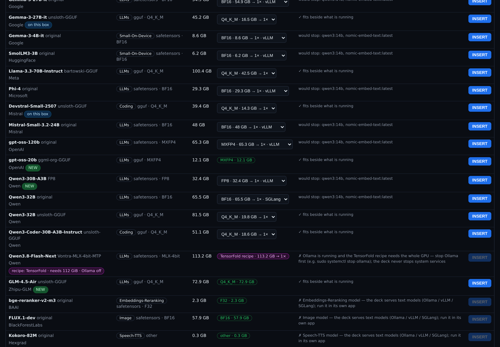 | 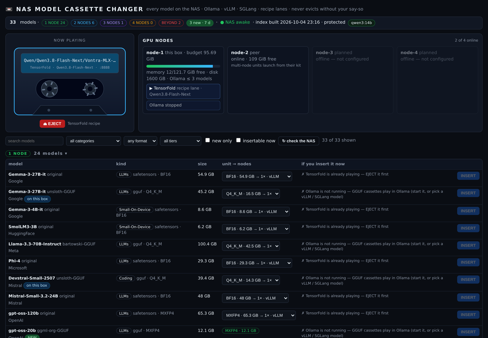 |
| **Selector on vLLM:** the architecture check refuses a model before the copy | **Loading:** the only time the reels turn |
| 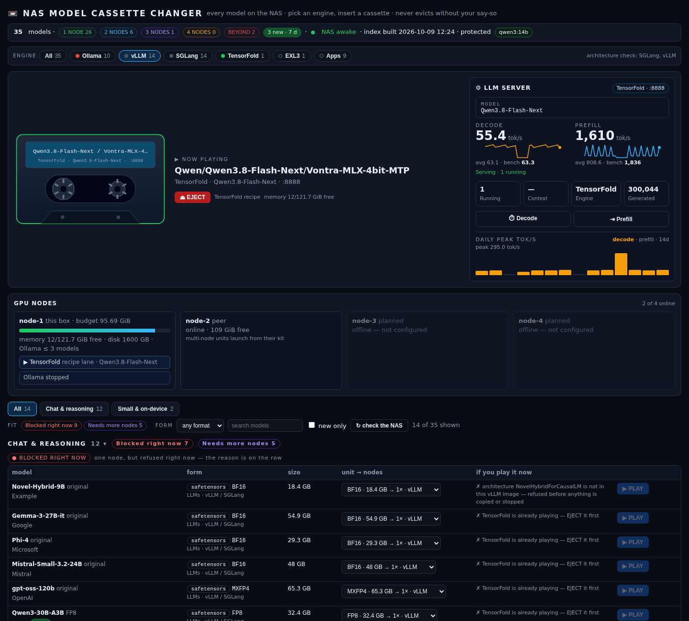 |  |

<p align="center">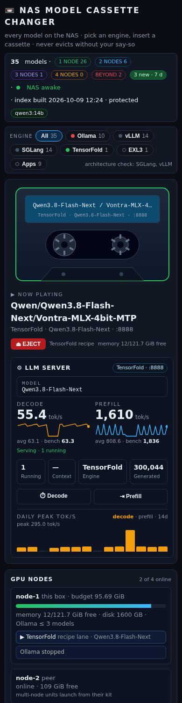<br><em>Works on a phone.</em></p>

## How it fits together

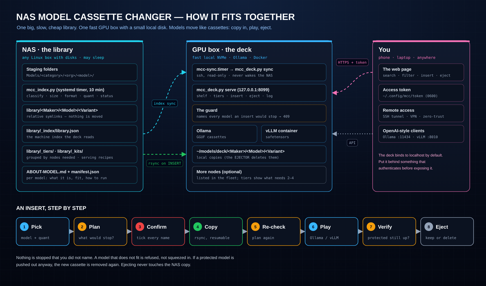

## How the node count is estimated

Each runnable unit (one GGUF quant, or one whole safetensors folder) gets the smallest node count *k* for which the weights plus per-node overhead fit:

`max(W + 5.6·k + 8, 1.15·W) ≤ 95.69·k`  (GiB, W = weights; defaults are tuned for a 128 GB unified-memory node)

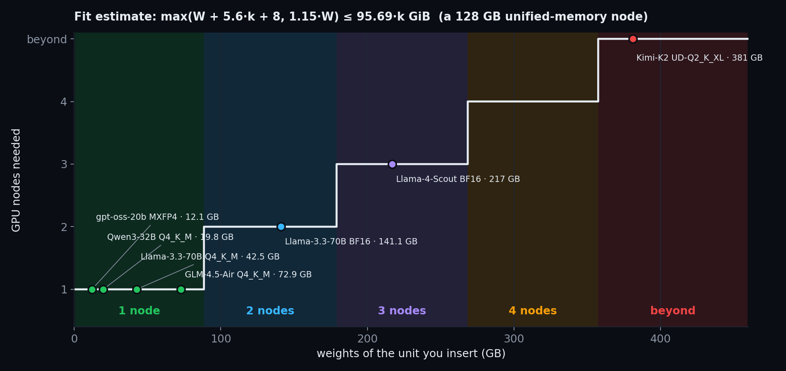

This is an estimate and a *floor*. Every constant is in the config, so you can tune it for your own cards. The deck itself only inserts single-node units; anything bigger is shown with its tier and any matching multi-node "kit" (a serving recipe kept on the NAS).

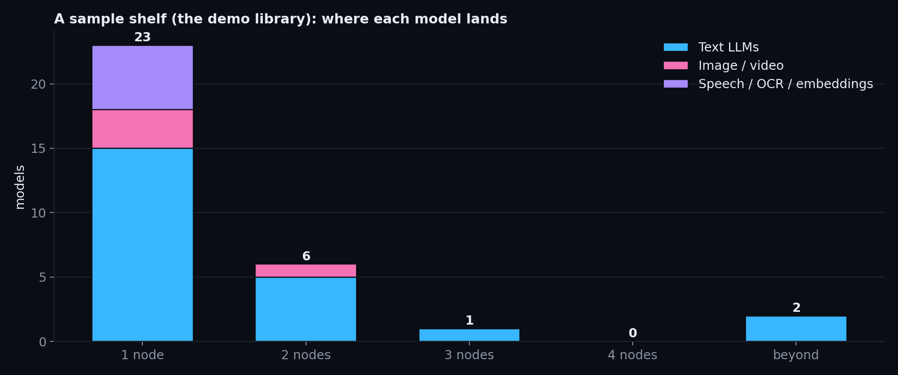

## Quick start (real hardware)

**On the NAS** (any Linux box holding your model folders):

```bash
sudo scripts/install-nas.sh                 # installs mcc_index.py + a 10-minute systemd timer
sudoedit /etc/mcc/nas.json                   # where your model folders are
python3 /usr/local/bin/mcc_index.py --dry-run
sudo systemctl enable --now mcc-index.timer
```

**On the GPU box:**

```bash
scripts/install-deck.sh                      # per-user install, no root
$EDITOR ~/.config/mcc/deck.json              # ssh alias of the NAS, its library path, protected models
python3 ~/.local/share/mcc/mcc_deck.py sync  # first copy of the index
systemctl --user enable --now mcc-sync.timer mcc-deck.service
```

Open `http://127.0.0.1:8099/` and paste the token from `~/.config/mcc/token`.

The full walkthrough is in the **[User Guide](docs/USER_GUIDE.md)**. It covers folder layouts, every config key, the guard rules, remote access, troubleshooting and the API.

## What it is not

- Not a downloader. Fetch models however you like (`huggingface-cli`, `git lfs`, a browser); the indexer picks them up on its next run.
- Not a multi-node scheduler. It shows which models need 2–4 nodes; launching those stays with the recipe that serves them.
- Not a fork of any serving engine. Ollama, vLLM, SGLang and TensorFold are separate projects; the deck only starts and stops them. TensorFold recipes come from their own repositories under their own licences.
- Not exposed to the internet by default. It listens on `127.0.0.1` and wants a token. See [SECURITY.md](SECURITY.md).

## Project layout

```
nas/mcc_index.py          NAS indexer: library view, tiers, kits, library.json, ABOUT-MODEL.md
deck/mcc_deck.py          GPU-box deck: sync, guard, insert/eject, web server, demo mode
deck/deck.html            the web page (no build step, no external assets)
examples/                 nas.example.json, deck.example.json, recipes.example.json (TensorFold)
nas/systemd, deck/systemd timers and services
scripts/                  install-nas.sh, install-deck.sh
tests/                    python -m unittest discover -s tests
docs/                     USER_GUIDE.md, images, and the scripts that draw them
```

## License

MIT. See [LICENSE](LICENSE). Model weights keep their own licences; each generated `ABOUT-MODEL.md` shows the licence from the model card.
